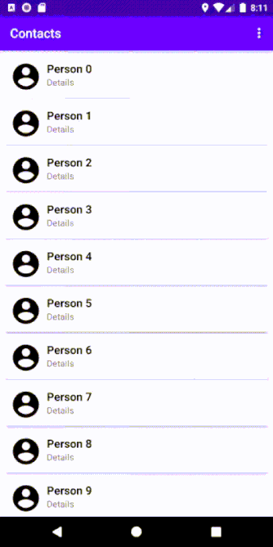

# RecyclerActionMode
 
In this project, we:
- demonstrate how to select multiple items in a RecyclerView
- use [actionMode](https://developer.android.com/guide/topics/ui/menus#context-menu) to perform actions with the selected item

